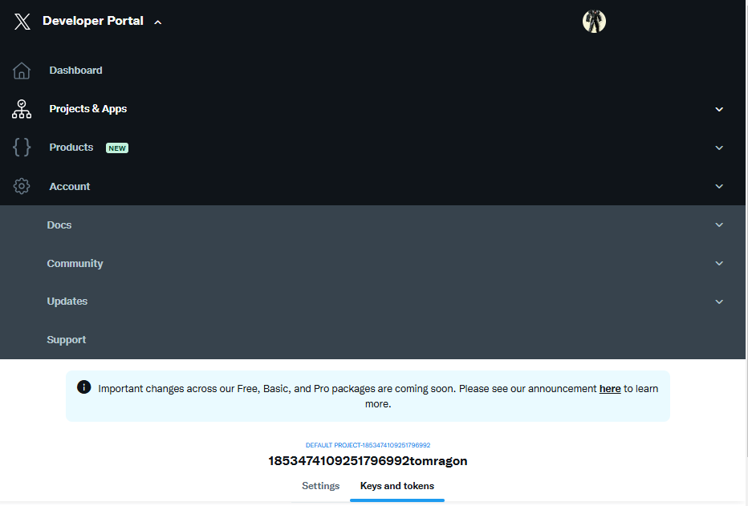
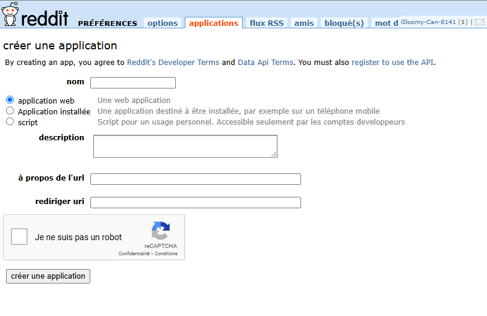

# Analyseur de Données de Réseaux Sociaux _(Trendly\*\*)_

## Étapes de Réalisation

### Préparation du Projet : Installation des Prérequis

1. **Installer Python et les bibliothèques nécessaires** :
   - Ouvrez un terminal et installez les bibliothèques Python suivantes :
     ```bash
     pip install tweepy praw pandas matplotlib seaborn textblob vaderSentiment streamlit
     ```
   - `Tweepy` pour Twitter, `PRAW` pour Reddit.
   - `Pandas` pour la manipulation de données, `Matplotlib` et `Seaborn` pour la visualisation.
   - `TextBlob` et `VADER` pour l’analyse de sentiments.
   - `Streamlit` pour créer un tableau de bord interactif.

### Étape 1 : Configurer les Accès API

1. **Obtenir les clés d'API Twitter et Reddit** :

   - Créez des comptes développeurs sur Twitter (https://developer.twitter.com) et Reddit (https://www.reddit.com/prefs/apps).

   #### X (twitter)

   

   #### reddit

   

   - Créez une application pour obtenir les clés API (consommateur et secret) pour Twitter et Reddit.

2. **Configurer les informations d’authentification dans votre code** :

   - Dans votre projet, créez un fichier `config.py` pour stocker les clés d’API.
   - Exemple de configuration dans `config.py` :
     ```python
     TWITTER_API_KEY = 'votre_clé_api'
     TWITTER_API_SECRET = 'votre_secret_api'
     REDDIT_CLIENT_ID = 'votre_id_client'
     REDDIT_CLIENT_SECRET = 'votre_secret_client'
     ```

### Étape 2 : Connexion aux API et Récupération des Données

1. **Connexion à l’API Twitter** :

   - Dans un fichier Python, importez `tweepy` et configurez l’authentification :

     ```python
     import tweepy
     from config import TWITTER_API_KEY, TWITTER_API_SECRET

     auth = tweepy.OAuthHandler(TWITTER_API_KEY, TWITTER_API_SECRET)
     api = tweepy.API(auth)
     ```

2. **Connexion à l’API Reddit** :

   - Importez `PRAW` et configurez la connexion :

     ```python
     import praw
     from config import REDDIT_CLIENT_ID, REDDIT_CLIENT_SECRET

     reddit = praw.Reddit(
         client_id=REDDIT_CLIENT_ID,
         client_secret=REDDIT_CLIENT_SECRET,
         user_agent="NomDeVotreApplication"
     )
     ```

3. **Récupération des Données en fonction de mots-clés** :

   - Pour Twitter :
     ```python
     tweets = api.search_tweets(q="votre_mot_clé", lang="fr", count=100)
     ```
   - Pour Reddit :
     ```python
     subreddit = reddit.subreddit("votre_sous_reddit")
     posts = subreddit.search("votre_mot_clé", limit=100)
     ```

### Étape 3 : Préparer et Manipuler les Données avec Pandas

1. **Créer un DataFrame pour stocker les données** :

   - Convertissez les données en un DataFrame `Pandas` :

     ```python
     import pandas as pd

     twitter_data = pd.DataFrame(
         [(tweet.text, tweet.created_at, tweet.user.screen_name) for tweet in tweets],
         columns=["Text", "Date", "User"]
     )

     reddit_data = pd.DataFrame(
         [(post.title, post.selftext, post.created_utc) for post in posts],
         columns=["Title", "Content", "Date"]
     )
     ```

2. **Nettoyer les données textuelles** :

   - Supprimez les URL, mentions, hashtags, et convertissez le texte en minuscules.
   - Utilisez `re` pour remplacer ou supprimer les éléments non pertinents :

     ```python
     import re

     twitter_data["Cleaned_Text"] = twitter_data["Text"].apply(
         lambda x: re.sub(r'http\S+|@\S+|#\S+', '', x.lower())
     )
     ```

### Étape 4 : Analyse des Données

1. **Calculer la fréquence des hashtags et mots-clés** :

   - Utilisez `collections.Counter` pour compter les hashtags et mots-clés.

     ```python
     from collections import Counter

     all_words = ' '.join(twitter_data["Cleaned_Text"]).split()
     word_counts = Counter(all_words)
     ```

2. **Analyse de sentiment** :

   - Utilisez `TextBlob` et `VADER` pour évaluer les sentiments (positif, neutre, négatif).

     ```python
     from textblob import TextBlob

     twitter_data["Sentiment"] = twitter_data["Cleaned_Text"].apply(
         lambda x: TextBlob(x).sentiment.polarity
     )
     ```

### Étape 5 : Visualisation des Résultats

1. **Créez des graphiques avec Matplotlib et Seaborn** :

   - Histogramme des sentiments :

     ```python
     import seaborn as sns
     import matplotlib.pyplot as plt

     sns.histplot(twitter_data["Sentiment"], kde=True)
     plt.title("Distribution des sentiments")
     plt.show()
     ```

   - Nuage de mots (Word Cloud) des mots-clés les plus fréquents :

     ```python
     from wordcloud import WordCloud

     wordcloud = WordCloud(width=800, height=400).generate(' '.join(all_words))
     plt.imshow(wordcloud, interpolation='bilinear')
     plt.axis("off")
     plt.show()
     ```

### Étape 6 : Créer un Tableau de Bord avec Streamlit

1. **Configurer un fichier `app.py` pour le tableau de bord Streamlit** :

   - Importez Streamlit et configurez des sections pour afficher les analyses :

     ```python
     import streamlit as st

     st.title("Analyseur de Données de Réseaux Sociaux")
     st.write("Visualisation des sentiments et fréquence des mots-clés.")
     ```

2. **Intégrer les graphiques et analyses dans le tableau de bord** :

   - Affichez les résultats de l’analyse de sentiments et les graphiques créés :

     ```python
     st.subheader("Distribution des Sentiments")
     st.pyplot(histogram_figure)

     st.subheader("Nuage de Mots")
     st.pyplot(wordcloud_figure)
     ```

3. **Lancer Streamlit pour afficher le tableau de bord** :

   - Dans le terminal, lancez l’application Streamlit :
     ```bash
     streamlit run app.py
     ```

### Étape 7 : Optimisation et Extensions

1. **Gestion des quotas d'API** :

   - Ajoutez des temporisations (ex. `time.sleep()`) pour respecter les quotas d’API.

2. **Extension : Analyse prédictive** :

   - Utilisez une bibliothèque comme `scikit-learn` pour ajouter des modèles prédictifs.

3. **Extension : Déployer le tableau de bord** :

   - Déployez votre tableau de bord sur des plateformes comme Heroku ou Streamlit Cloud pour le rendre accessible en ligne.

---

Ces étapes vous permettent de créer un analyseur de données de réseaux sociaux de bout en bout, de la récupération des données API jusqu'à la visualisation interactive.
